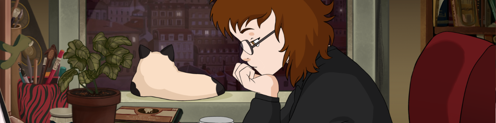

<h1 style="color: #9f86c0">Hi there! I'm Karol 
  
</h1>

  

    I have a degree in <b>Psychology</b> and worked in the field for about three years, where I was able to develop essential skills such as communication and problem-solving. In 2024, I decided to follow my dream of diving into the world of technology. I am currently studying Systems Analysis and Development, and every day I discover more about this fascinating field. I am driven by the constant search for knowledge, I love reading (especially about topics that broaden my worldview) and, of course, I never give up a good cup of <b>Coffee</b> to accompany my learning journeys.
  

  <h2 style="color: rgb(96, 126, 190);">Stack</h2>
   

  <!-- Ícones das tecnologias -->
  

    
    
    
    
    
    
    
    
    
    
  

  <!--Quotes-->
  

